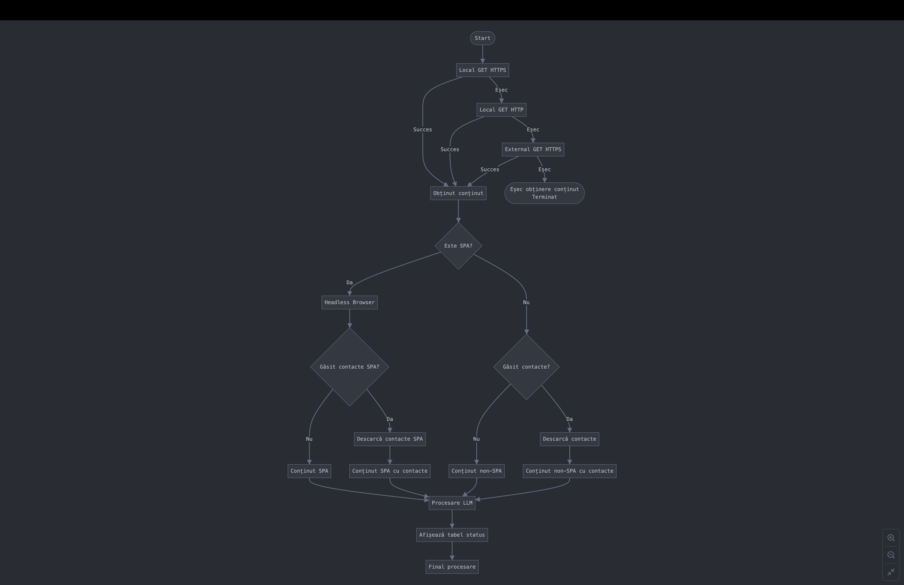
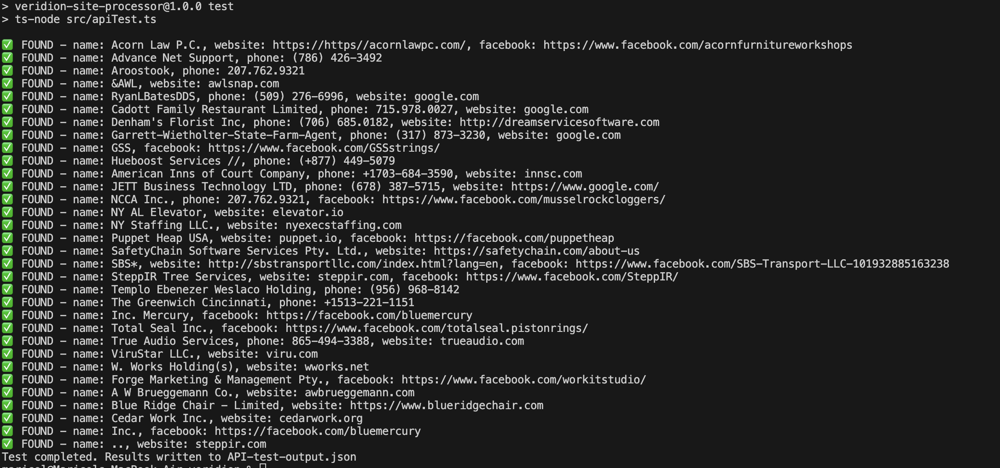

# Site Processor

A modularized application designed to download site content, process it, and extract data using an LLM.

## Prerequisites

- [Node.js](https://nodejs.org/) (version 18 or higher)
- npm (comes with Node.js)
- Google Gemini API Key (required for the `scrape` command)
- [Elasticsearch](https://www.elastic.co/elasticsearch/) (optional, only required for `ingest` and `api` commands)

## Installation

1. Clone the repository or download the source code
2. Navigate to the project directory in your terminal
3. Install the dependencies by running:

```bash
npm install
```

This command will install all the required dependencies defined in the package.json file, including:
- cheerio (for HTML parsing)
- dotenv (for environment variables)
- got (for HTTP requests)
- puppeteer (for headless browsing)
- turndown (for HTML to text conversion)
- TypeScript and related type definitions
- express (for the API server)
- elasticsearch (for data storage and querying)

## Configuration

The application uses environment variables for configuration. Make sure to set up your `.env` file with the necessary values:

```
# For the scrape command
GEMINI_API_KEY=your_gemini_api_key
# This can be be obtain free from https://aistudio.google.com/ . The free rate limits are enough for this project.


# For ingest and api commands
ELASTICSEARCH_NODE=http://localhost:9200
ELASTICSEARCH_INDEX=websites_data
ELASTICSEARCH_USERNAME=user
ELASTICSEARCH_PASSWORD=password
# OR
ELASTICSEARCH_API_KEY=your_api_key

# API configuration (optional)
PORT=3000
```

## Available Commands

The project includes several npm scripts to help you run the application:

### 1. Website Data Extraction (`scrape`)

This command processes websites to extract contact information:

```bash
npm run scrape
```

**What it does:**
- Reads URLs from the `input.csv` file
- Downloads website content using various strategies (HTTPS, HTTP)
- Automatically detects Single Page Applications (SPAs) and uses a headless browser
- Identifies and processes contact pages
- Processes content with an LLM (Google Gemini) to extract:
  - Phone numbers
  - Social media links
  - Physical addresses
- Saves data to JSON files and a consolidated `all_results.json` file
- Generates error reports and extraction analysis
- Executes up to 30 parallel downloads for efficiency



The diagram above shows the complete flow from initial URL processing through content downloading, SPA detection, contact page extraction, and finally LLM processing for data extraction.

**Example output from scrape command:**

The application provides detailed extraction analysis (also saved to crawling_analysis.txt):

```
=== EXTRACTION ANALYSIS ===
Total websites in input: 997
Successfully crawled: 739/997 (74.12%)
Failed to crawl: 258/997 (25.88%)

Coverage (sites with data):
- Phone Numbers: 405/997 sites (40.62%)
- Social Media Links: 261/997 sites (26.18%)
- Addresses: 305/997 sites (30.59%)
- Overall Fill Rate: 32.46%

Extracted Datapoints:
- Phone Numbers: 573 datapoints
- Social Media Links: 610 datapoints
- Addresses: 381 datapoints
- Total Datapoints: 1564

Summary:
Successfully crawled 739 websites and extracted 1564 datapoints.
Average datapoints per site: 1.57
=============================
```

And provides a final summary with timing information:

```
--- Final Summary ---
Total Sites Processed: 997
Successful: 997
Errors: 0
Total Duration: 476.27 s
---------------------
```

### 2. Importing Data to Elasticsearch (`ingest`)

After extracting data, this command imports it into Elasticsearch:

```bash
npm run ingest
```

**What it does:**
- Reads extracted data from `all_results.json`
- Combines data with company information from `sample-websites-company-names.csv`
- Connects to Elasticsearch using the configuration from `.env`
- Deletes the existing index and creates a new one with the proper mapping
- Loads the combined data into Elasticsearch in batches for performance
- Provides a detailed report about the ingestion process

### 3. Starting the API Server (`api`)

This command starts an API server for querying the data:

```bash
npm run api
```

**What it does:**
- Starts an Express server on the specified port (default 3000)
- Exposes a `/match` endpoint that accepts POST requests
- Accepts parameters such as:
  - `input_name` - Company name (fuzzy matching)
  - `input_phone` - Phone number (exact matching)
  - `input_website` - Website (exact matching)
  - `input_facebook` - Facebook link (exact matching)
- Searches Elasticsearch using these parameters
- Returns the best matching company information

### 4. API Testing (`test`)

This command runs an automated test of the API:

```bash
npm run test
```



**What it does:**
- Reads test data from `API-input-sample.csv` file
- Sends a POST request to the API for each row in the CSV
- Records success/failure responses for each request
- Saves test results to `API-test-output.json`
- Useful for validating API functionality with multiple test cases

## Complete Workflow

The application is designed to work as a processing pipeline:

1. **Data Extraction** (`npm run scrape`):
   - Processes URLs from `input.csv`
   - Extracts contact information using LLM
   - Generates `all_results.json` with all extracted data

2. **Elasticsearch Import** (`npm run ingest`):
   - Reads `all_results.json` and `sample-websites-company-names.csv`
   - Combines information and imports it into Elasticsearch

3. **Data Querying** (`npm run api`):
   - Starts an API server that allows searching for companies
   - Provides results based on matching parameters

## Output Files

The application generates several output files during execution:

### Main Output Files (Root Directory)

- **all_results.json**: Consolidated JSON file containing all extracted data from all processed websites
- **crawling_analysis.txt**: Detailed analysis report with statistics about the crawling and extraction process
- **error_report.log**: Comprehensive error report categorizing errors as download errors, LLM errors, or unexpected errors

### Per-Website Output Files

- **download/{website_hostname}.txt**: Raw downloaded content of each website
- **download/{website_hostname}.error.log**: Error logs for individual sites (if errors occurred)
- **download/json_results/{website_hostname}.json**: Individual JSON files containing extracted data for each site

### API Usage Example

To query data through the API, send a POST request to `/match` with one or more parameters:

```bash
curl -X POST http://localhost:3000/match \
  -H "Content-Type: application/json" \
  -d '{
    "input_name": "Acme Corporation",
    "input_website": "acme.com"
  }'
```

The response will be a JSON object with the company information:

```json
{
  "domain": "acme.com",
  "company_commercial_name": "Acme Corporation",
  "company_legal_name": "Acme Inc.",
  "phone_numbers": ["+1 (555) 123-4567"],
  "social_media_links": [
    "https://linkedin.com/company/acme-corporation",
    "https://twitter.com/AcmeCorp"
  ],
  "addresses": ["123 Main Street, San Francisco, CA 94105, USA"],
  "timestamp": "2025-03-31T11:45:22.345Z"
}
```

## Troubleshooting

If you encounter any issues:

1. Ensure Node.js version 18+ is installed
2. Check that your `.env` file is properly configured
3. For Elasticsearch issues:
   - Verify that the Elasticsearch service is running
   - Check the credentials and URL in `.env`
4. For data extraction issues:
   - Check the `error_report.log` file for details
   - Make sure the `input.csv` file contains valid URLs
